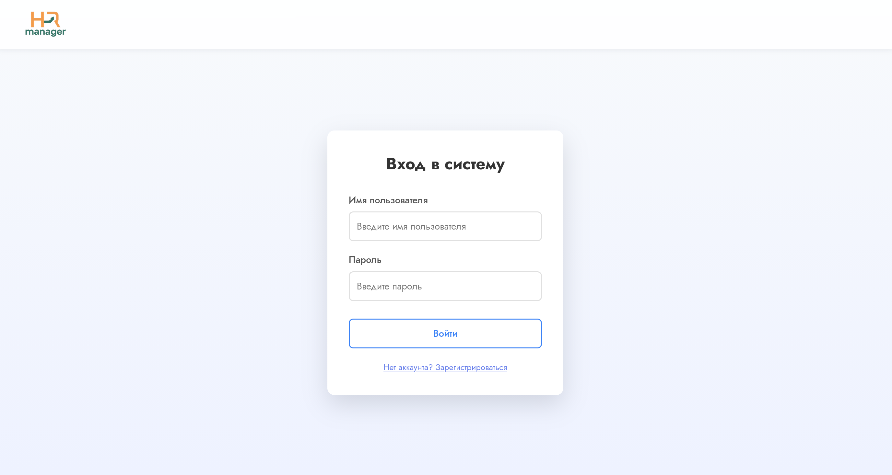
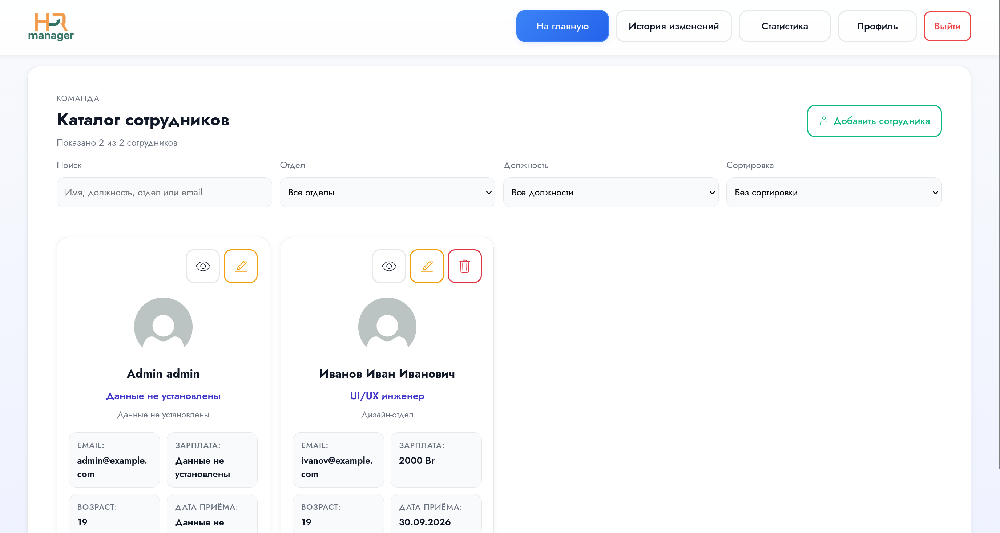
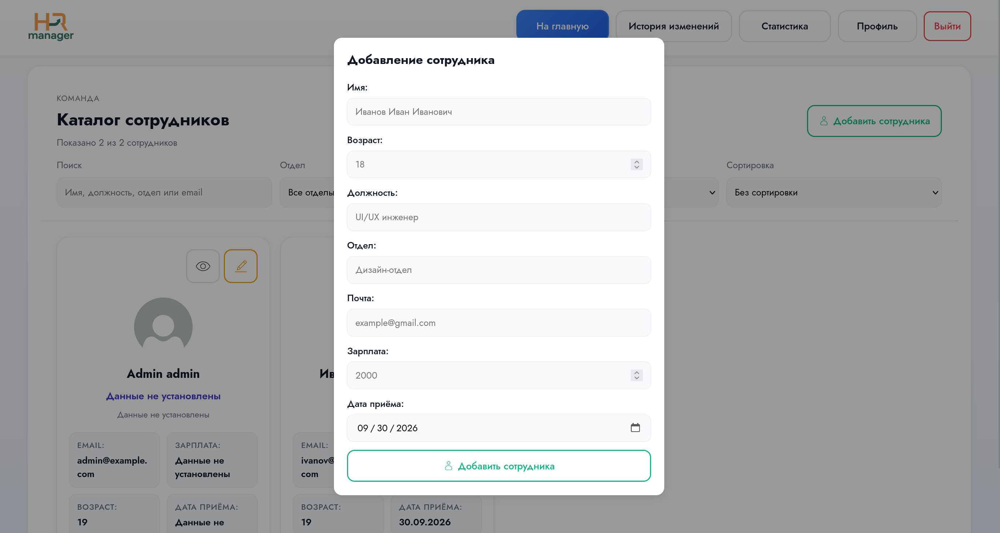
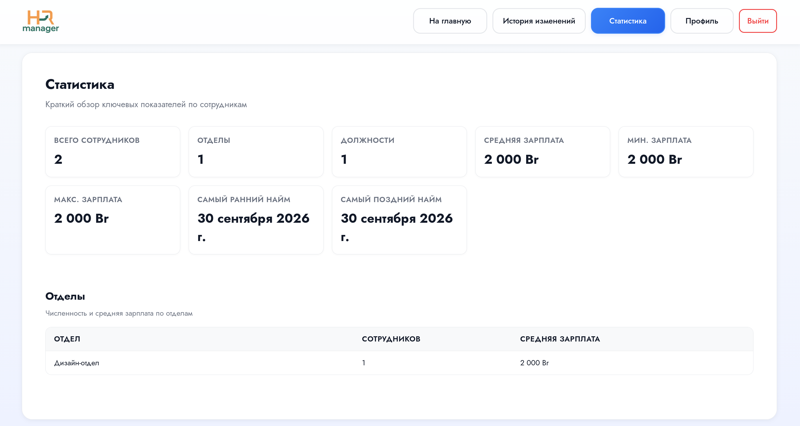
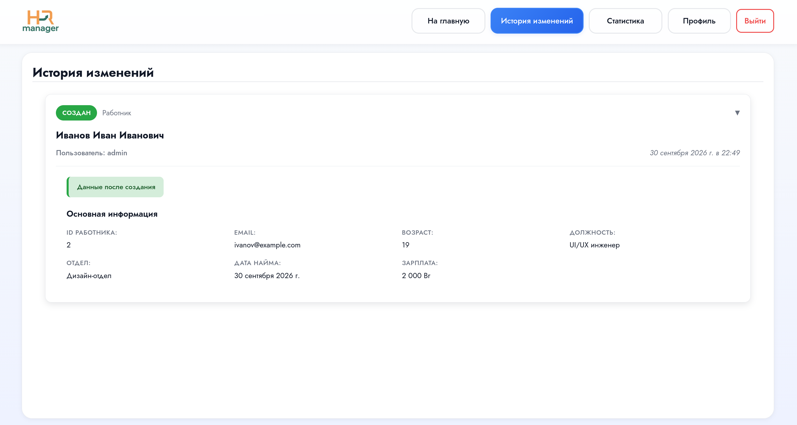

# Веб-приложение для ведения кадрового учёта

Full-stack веб-приложение для управления данными сотрудников, аутентификацией, историей изменений и сопутствующей информацией.

## Возможности

* Аутентификация пользователей с использованием JWT
* Разграничение доступа на основе ролей
* Добавление, редактирование и удаление сотрудников
* Просмотр истории изменений сотрудников
* Поиск и фильтрация сотрудников
* Просмотр статистики
* Загрузка аватаров сотрудников
* REST API
* Хранение данных в PostgreSQL
* Документация REST API с использованием Swagger

## Технологии

При написании приложения использован следующий стек технологий: 

### Backend

* Java 17
* Spring Boot
* Spring Security
* Spring Data JPA
* Hibernate ORM
* Swagger / OpenAPI
* PostgreSQL
* JWT
* Maven

### Frontend

* React
* Vite
* Axios
* React Router

## Начало работы

Для запуска проекта необходимы:

* Java 17+
* PostgreSQL 17.5+
* Node.js 24.11.1+
* npm

### 1. Создание базы данных

Создайте базу данных PostgreSQL:

```sql
CREATE DATABASE courseworkdb;
```

Структура таблиц создаётся автоматически при первом запуске приложения с помощью Hibernate.

### 2. Переменные окружения

Создайте файл `.env` на основе `.env.example` и укажите параметры подключения к базе данных и секретный ключ JWT.

Пример:

```env
DB_URL=jdbc:postgresql://localhost:5432/courseworkdb
DB_USERNAME=username
DB_PASSWORD=password
JWT_SECRET=secret_key
UPLOAD_PATH=uploads
```

## Запуск Backend

Перейдите в директорию backend:

```bash
cd backend
```

Запустите приложение. Для Linux:

```bash
./mvnw spring-boot:run
```

Для Windows:

```cmd
mvnw.cmd spring-boot:run
```

После запуска backend будет доступен по адресу
http://localhost:8080

## Запуск Frontend

Перейдите в директорию frontend:

```bash
cd frontend
```

Установите зависимости:

```bash
npm install
```

Запустите сервер разработки:

```bash
npm run dev
```

После запуска Vite выведет адрес приложения в терминале. По умолчанию используется
http://localhost:5173

## Документация API

После запуска backend документация REST API доступна через Swagger UI по адресу
http://localhost:8080/swagger-ui/index.html

## Конфигурация

Основные параметры приложения находятся в:

```text
backend/src/main/resources/application.properties
```

Настройки подключения к базе данных и секретные параметры передаются через переменные окружения.

## Скриншоты

### Регистрация



### Авторизация


### Главная страница



### Добавление сотрудника



### Статистика



### История изменений



## 

Проект разработан в учебных и демонстрационных целях.
